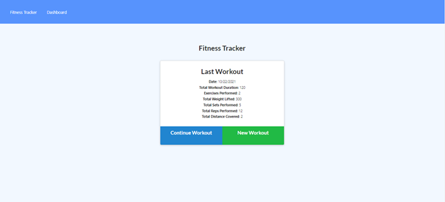
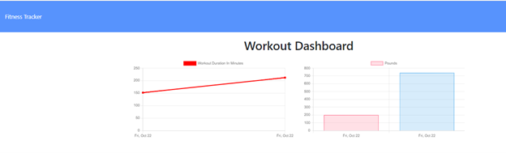
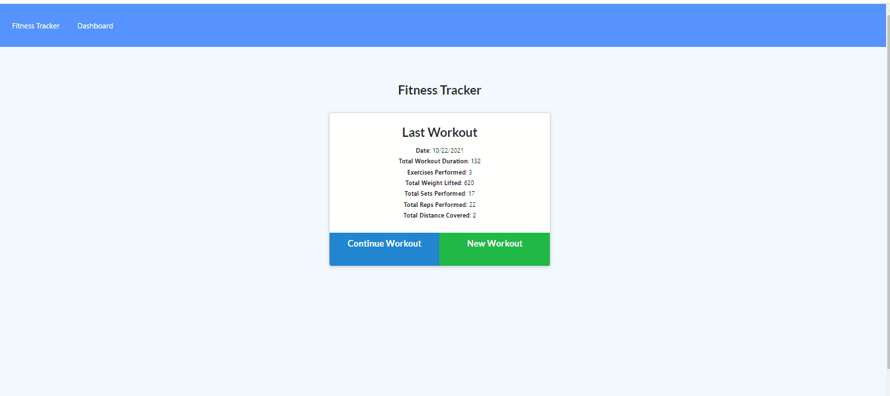

### Fitness Tracker

This app create a workout tracker

### User Story

* As a user, I want to be able to view create and track daily workouts. I want to be able to log multiple exercises in a workout on a given day. I should also be able to track the name, type, weight, sets, reps, and duration of exercise. If the exercise is a cardio exercise, I should be able to track my distance traveled.

### Business Context

A consumer will reach their fitness goals more quickly when they track their workout progress.

### App 

</img>

</img>

## Installation

1. Clone repository. 
2. npm install
3. mongod
5. node server.js

### Web Address
https://fitness-tracker-us.herokuapp.com/ 

### Author

-  Elham Bazazzadeh: [portfolio]( https://ebazazzadeh.github.io/portfolio/)

